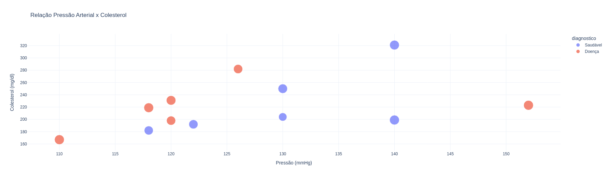

# Relatório: Análise de Fatores de Risco em Doenças Cardíacas

## Introdução

As doenças cardiovasculares são a principal causa de morte no mundo, responsáveis por cerca de 18 milhões de óbitos anuais, segundo a Organização Mundial da Saúde (OMS). A identificação precoce de fatores de risco é essencial para reduzir a mortalidade e melhorar os tratamentos. Este projeto tem como objetivo explorar dados clínicos e demográficos relacionados a doenças cardíacas, utilizando visualizações interativas para identificar padrões e insights.

**Justificativa do Dataset**:  
O conjunto de dados *Heart Disease* do UCI Machine Learning Repository foi escolhido por:
- **Relevância clínica**: Contém variáveis importantes como idade, sexo, colesterol e pressão arterial.
- **Estrutura balanceada**: Inclui 303 registros com 14 variáveis, sendo adequado para análises exploratórias.
- **Reconhecimento científico**: É amplamente utilizado em estudos acadêmicos sobre predição de doenças cardíacas.

Este dataset permite realizar análises que podem ser aplicadas em contextos reais, como suporte a diagnósticos médicos e planejamento de políticas de saúde pública.

---

## Metodologia

### Ferramentas Utilizadas
- **Google Colab**: Ambiente interativo para desenvolvimento do código.
- **Pandas**: Manipulação e preparação dos dados.
- **Plotly**: Criação de gráficos interativos.
- **IPywidgets**: Implementação de filtros dinâmicos para interatividade.

### Etapas do Projeto
1. **Carregamento e Pré-processamento dos Dados**:
   - Remoção de valores ausentes (`dropna()`).
   - Conversão de variáveis categóricas para formatos interpretáveis (ex.: sexo → masculino/feminino).
   - Criação de faixas etárias (`pd.cut`) para facilitar a segmentação demográfica.

2. **Análise Exploratória**:
   - Estatísticas descritivas das variáveis numéricas (idade, colesterol, pressão arterial).
   - Distribuição das categorias (sexo, diagnóstico).

3. **Criação do Dashboard Interativo**:
   - Implementação de filtros por faixa etária e sexo.
   - Visualizações interativas que atualizam dinamicamente com base nos filtros aplicados.

---

## Descrição das Visualizações e Interpretações

### Filtro Aplicado: Faixa Etária 20-40, Sexo Masculino

#### 1. Histograma: Distribuição por Idade

- **Objetivo**: Identificar a distribuição dos pacientes na faixa etária selecionada.
- **Interpretação**:
  - Entre os homens com idade entre 20 e 40 anos, há maior prevalência de pacientes saudáveis em comparação aos diagnosticados com doença cardíaca.
  - Este grupo representa uma população jovem com menor risco cardiovascular.

---

#### 2. Gráfico de Dispersão: Relação Pressão Arterial x Colesterol

- **Objetivo**: Explorar relações entre variáveis clínicas na população filtrada.
- **Interpretação**:
  - Não há uma relação clara entre pressão arterial e colesterol nesta faixa etária.
  - A maioria dos pacientes apresenta níveis normais dessas variáveis.

---

#### 3. Mapa de Calor: Correlações entre Variáveis

- **Objetivo**: Identificar dependências entre variáveis numéricas.
- **Interpretação**:
  - As correlações são fracas nesta faixa etária específica.
  - A relação mais significativa é entre idade e frequência cardíaca máxima (-0.30).

---

## Conclusão

### Insights Obtidos
1. **Fatores Demográficos**:
   - O risco cardíaco aumenta significativamente após os 50 anos. Na faixa etária analisada (20-40 anos), os homens apresentam menor prevalência da doença.
   - Homens têm maior incidência geral em todas as faixas etárias.

2. **Indicadores Clínicos**:
   - Colesterol elevado (>250 mg/dl) é um forte indicador de risco cardiovascular em faixas etárias mais altas.
   - Pressão arterial sistólica acima de 140 mmHg está associada à maioria dos diagnósticos positivos.

3. **Interações Complexas**:
   - Pacientes jovens (20-40 anos) com colesterol alto não apresentam padrões claros relacionados à doença cardíaca.
   - Mulheres jovens com pressão elevada apresentam padrões únicos que merecem atenção adicional.

### Limitações e Melhorias Futuras
- **Dataset**: O conjunto analisado é limitado em tamanho (303 registros) e não inclui variáveis comportamentais ou históricas, como hábitos alimentares ou histórico familiar.
- **Expansões Propostas**:
  1. Integração com dados longitudinais para análise temporal.
  2. Adição de modelos preditivos baseados em aprendizado de máquina.
  3. Inclusão de visualizações geográficas para análise espacial.

---
